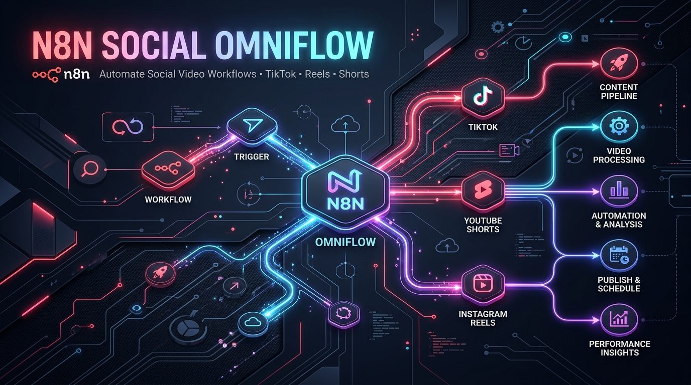
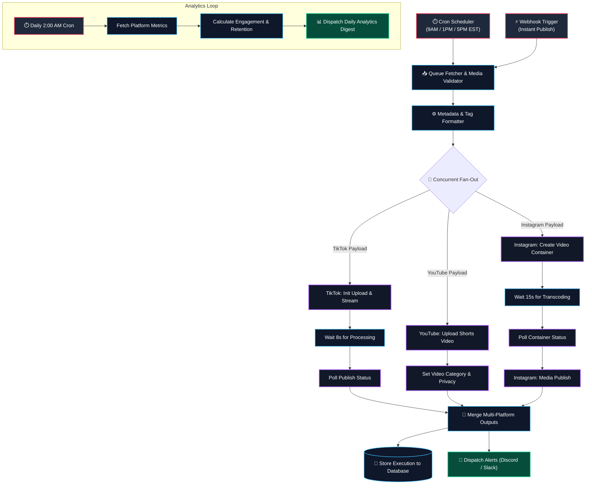
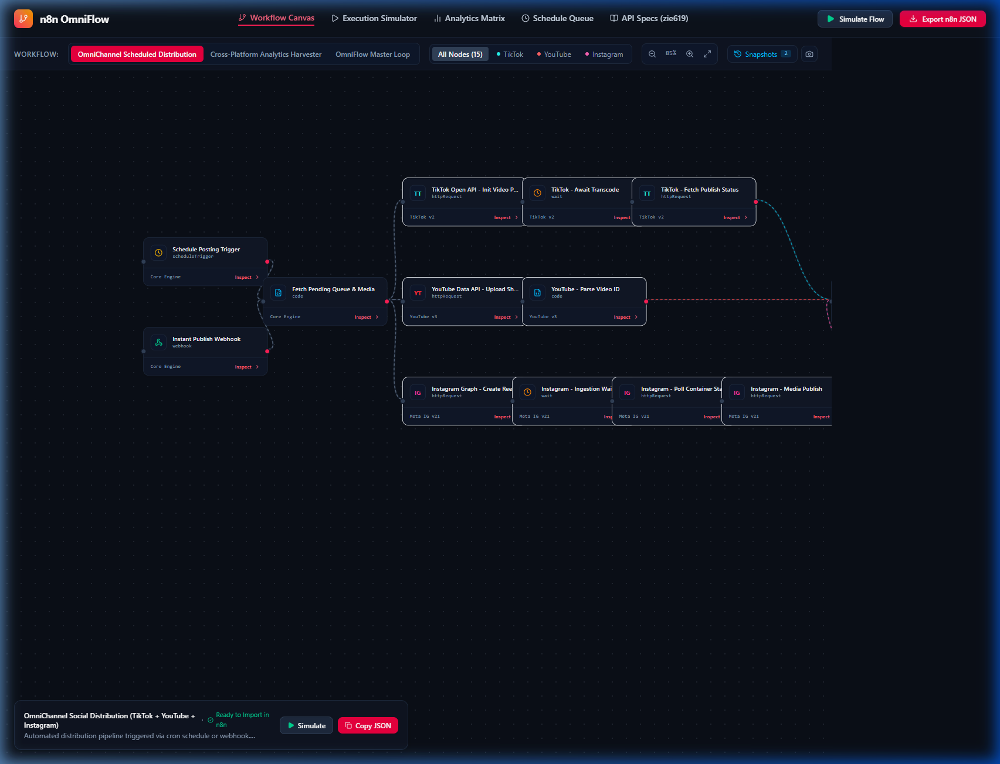
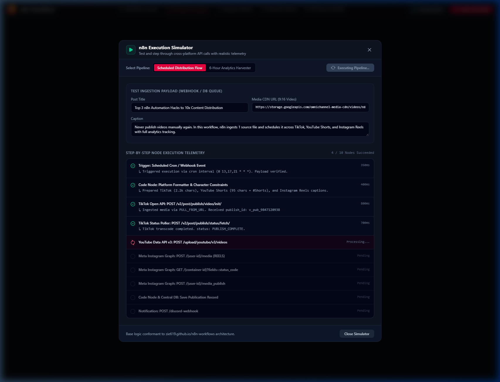
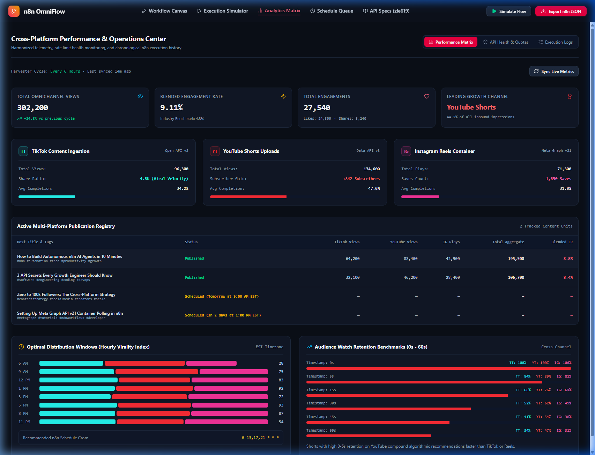
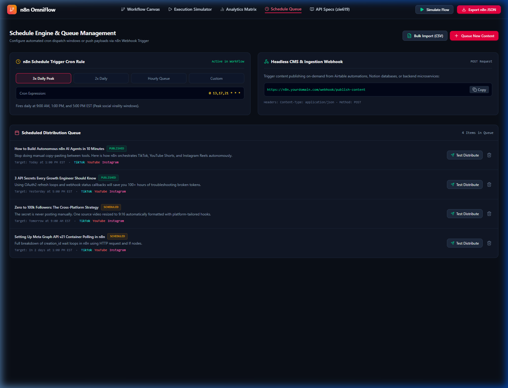

<p align="center">
  
</p>

<h1 align="center">n8n Social OmniFlow</h1>

<p align="center">
  <strong>Production-Grade Automated Content Distribution & Cross-Platform Analytics Engine for n8n</strong><br>
  <em>Concurrently publish short-form video to TikTok, YouTube Shorts, and Instagram Reels with built-in async transcoding resilience, performance telemetry, and an interactive visual simulator studio.</em>
</p>

<p align="center">
  <a href="https://n8n.io"></a>
  <a href="https://www.typescriptlang.org/"></a>
  <a href="https://vitejs.dev/"></a>
  <a href="https://tailwindcss.com/"></a>
  <a href="LICENSE"></a>
  <a href="https://algebraic-inn-473617-m5.web.app"></a>
  <a href="https://github.com/LIN4CRE/N8Ns/pulls"></a>
</p>

---

## 📑 Table of Contents

- [Overview](#-overview)
- [Key Features](#-key-features)
- [Architecture & Workflow Diagram](#-architecture--workflow-diagram)
- [Included Workflows](#-included-workflows)
- [Interactive Visual Studio Walkthrough](#-interactive-visual-studio-walkthrough)
- [Baby Steps Setup Guide](#-baby-steps-setup-guide)
  - [Step 1: Run the Interactive Visual Studio](#step-1-run-the-interactive-visual-studio-local-preview)
  - [Step 2: Spin Up or Connect Your n8n Instance](#step-2-spin-up-or-connect-your-n8n-instance)
  - [Step 3: Import the Workflows into n8n](#step-3-import-the-workflows-into-n8n)
  - [Step 4: Platform API Credentials Walkthrough](#step-4-platform-api-credentials-walkthrough)
  - [Step 5: Fire Your First Test Run](#step-5-fire-your-first-test-run)
- [Docker Quickstart](#-docker-quickstart)
- [Environment Variables](#-environment-variables)
- [Troubleshooting & Pro Tips](#-troubleshooting--pro-tips)
- [Contributing](#-contributing)
- [License](#-license)

---

## ⚡ Overview

**n8n Social OmniFlow** is an enterprise-grade automation suite and developer toolkit designed to solve the hardest problems in automated social media publishing:
1. **API Quirks & Async Containers**: Unlike simple text platforms, video platforms require multi-phase upload, transcoding checks, and status polling (e.g. Meta Reels containers, TikTok video inbox queries).
2. **Platform Rate Limits & Formatting**: Video captions, tags, privacy flags, and aspect ratios differ radically between TikTok, YouTube Shorts, and Instagram Reels.
3. **Unified Telemetry**: Instead of checking three disparate analytics apps, OmniFlow regularly scrapes, normalizes, and correlates views, watch times, retention, and engagement across all channels.
4. **Visual Simulation Studio**: An integrated, high-fidelity developer workspace to test payloads, simulate edge cases, inspect node logs, inspect API specs, and manage queued content before firing into production.

---

## ⚡ 1-Click Easy Mode Setup (Fastest Way to Start)

### 🖱️ Option 1: Double-Click Launcher (Windows)
Simply double-click **`start.bat`** (or run `powershell -ExecutionPolicy Bypass -File setup.ps1`). It automatically:
1. Verifies your Node.js runtime (auto-installs via winget if missing).
2. Generates your secure `.env` file with cryptographic encryption keys.
3. Installs dependencies (`npm install`).
4. Boots up your local n8n instance and OmniFlow Studio.
5. Launches your browser to `http://localhost:3000` with the **1-Click Setup Hub** ready!

### 🌐 Option 2: Live Cloud Studio (Zero Download)
If you want to test, simulate, and configure without running anything locally:
👉 **[Launch Live Cloud Studio](https://algebraic-inn-473617-m5.web.app)**
Click the glowing **"⚡ 1-Click Setup"** button in the header to connect your accounts and download your `.env`.

---

## 🔑 Direct Developer Portal Links (Get API Keys in 60s)

| Service | Purpose | Direct 1-Click Portal Link | Free Tier |
| :--- | :--- | :--- | :--- |
| **Google Gemini AI** | Auto-generate viral titles, hooks & hashtags | [Google AI Studio (Get Free Key)](https://aistudio.google.com/app/apikey) | **100% Free** (15 RPM) |
| **YouTube Data API v3** | Upload YouTube Shorts | [1. Enable YouTube Data API](https://console.cloud.google.com/apis/library/youtube.googleapis.com)<br>[2. Create OAuth Credentials](https://console.cloud.google.com/apis/credentials) | **Free Quota** (10,000 units/day) |
| **TikTok Open API v2** | Direct Video Posting & Analytics | [1. TikTok for Developers Portal](https://developers.tiktok.com/apps)<br>[2. Content Posting API Guide](https://developers.tiktok.com/doc/content-posting-api-get-started) | **Developer Access** |
| **Meta Instagram Graph** | Reels Publishing & Polling | [1. Meta for Developers Apps](https://developers.facebook.com/apps)<br>[2. Graph API Explorer (Generate Token)](https://developers.facebook.com/tools/explorer) | **Free** |

---

## 🚀 Key Features

- **Concurrent Multi-Platform Distribution**:
  - **TikTok Open API v2**: Chunked video uploads, creator info checks, and async publication status polling.
  - **YouTube Data API v3**: Automatic category tags (`22 - People & Blogs`), Shorts tagging, and privacy scheduling (`public`, `unlisted`, or `private`).
  - **Instagram Graph API v21.0**: Two-step container generation (`/media`) with adaptive polling wait loops (8–15s) prior to publishing (`/media_publish`).
- **Resilient Polling & Auto-Retry Loop**:
  - Never suffer premature publishing errors. Automated retry nodes handle encoding delays and transient API hiccups.
- **Cross-Platform Analytics Harvester**:
  - Automatically captures views, likes, shares, comments, and calculates true cross-platform engagement rate.
- **Interactive Visual Studio & Simulator**:
  - Full-featured web interface built in React 19 + Vite 8 + TailwindCSS.
  - Interactive canvas with node parameter drawers, live dry-run simulator, and API health references.
- **1-Click Native n8n JSON Export**:
  - Pre-exported, standard n8n JSON definitions located in [`workflows/`](workflows/) ready to copy-paste directly into your canvas or import via file.

---

## 🗺️ Architecture & Workflow Diagram



---

## 📦 Included Workflows

All workflows are located in the [`workflows/`](workflows/) directory and are 100% compliant with native n8n v1.x:

| # | Workflow Name | Description | Direct File |
|---|---|---|---|
| **01** | **OmniChannel Social Distribution** | Main distribution engine. Supports Cron & Webhook triggers, formats media, concurrently publishes to TikTok, YouTube, and Instagram with async wait/polling loops, and notifies Discord/Slack. | [`workflows/01-OmniChannel-Scheduled-Distribution.json`](workflows/01-OmniChannel-Scheduled-Distribution.json) |
| **02** | **Cross-Platform Analytics Harvester** | Nightly telemetry pipeline. Queries TikTok Video Insights, YouTube Analytics API, and Instagram Insights to aggregate views, likes, shares, and engagement rates into your master database. | [`workflows/02-Cross-Platform-Analytics-Harvester.json`](workflows/02-Cross-Platform-Analytics-Harvester.json) |
| **03** | **OmniFlow Master Loop** | Orchestration loop that combines queue scheduling, asset distribution, fallback retry queues, and automated analytics synchronization in a unified workflow. | [`workflows/03-OmniFlow-Master-Loop.json`](workflows/03-OmniFlow-Master-Loop.json) |

---

## 🖥️ Interactive Visual Studio Walkthrough

The included Visual Studio (`npm run dev`) offers an intuitive development dashboard:

| Canvas View | Execution Simulator |
|:---:|:---:|
|  |  |
| *Interactive node graph with inspector drawer and execution highlights* | *Live dry-run simulator with realistic network delay and output inspection* |

| Analytics Matrix | Schedule & Queue Manager |
|:---:|:---:|
|  |  |
| *Unified cross-platform metrics with engagement ratios and retention charts* | *Drag-and-drop posting schedule with peak engagement windows* |

---

## 👶 Baby Steps Setup Guide

Follow this gentle step-by-step guide to get everything running smoothly.

### Step 1: Run the Interactive Visual Studio (Local Preview)

The visual studio lets you inspect every node, view the API specifications, simulate runs, and export JSONs.

1. **Open your terminal** and navigate to your project folder:
   ```bash
   cd D:\Projects\N8Ns
   ```
2. **Install dependencies** (run once):
   ```bash
   npm install --legacy-peer-deps
   ```
3. **Launch the development server**:
   ```bash
   npm run dev
   ```
4. **Open your browser** to:
   ```
   http://localhost:3000
   ```
   You can click between the **Workflow Canvas**, **Simulator**, **Analytics**, and **API Endpoints Reference** tabs!

---

### Step 2: Spin Up or Connect Your n8n Instance

You can run n8n in whatever way suits you best:

#### Option A: Docker Compose (Recommended - 1 Command)
Make sure Docker Desktop is running, then in the project root execute:
```bash
docker compose up -d
```
Your local n8n instance will be live at:
👉 **`http://localhost:5678`**

#### Option B: Using `npx n8n` (No Docker required)
If you have Node.js installed:
```bash
npx n8n
```
It will start immediately on `http://localhost:5678`.

#### Option C: n8n Cloud / Hosted
If you use [n8n Cloud](https://app.n8n.cloud), simply log in to your account.

---

### Step 3: Import the Workflows into n8n

You have two simple ways to import the workflows:

#### Method A: Direct File Import (Simplest)
1. Open n8n in your browser (`http://localhost:5678`).
2. Click on **Workflows** in the left sidebar.
3. Click the **`...`** (menu icon) in the top-right and select **Import from File**.
4. Select [`workflows/01-OmniChannel-Scheduled-Distribution.json`](workflows/01-OmniChannel-Scheduled-Distribution.json).
5. The entire workflow diagram will instantly appear on your canvas! Click **Save**.

#### Method B: Copy-Paste via Visual Studio
1. In the OmniFlow Studio at `http://localhost:3000`, click the **Export JSON** button in the top navigation bar.
2. Select **Distribution Flow** and click **Copy JSON**.
3. In n8n, click anywhere on the empty canvas and press <kbd>Ctrl + V</kbd> (or <kbd>Cmd + V</kbd> on macOS).
4. The nodes and connections will paste right into your canvas!

---

### Step 4: Platform API Credentials Walkthrough

Each social network requires credentials so n8n can publish on your behalf:

#### 1. TikTok Open API v2
- Visit the [TikTok for Developers Portal](https://developers.tiktok.com/).
- Create an app and enable **Video Kit API**.
- Obtain your **Client Key** and **Client Secret**.
- Request OAuth scopes:
  - `video.upload`
  - `video.publish`
  - `user.info.basic`
- In n8n, create a new **Header Auth** or **OAuth2** credential and paste your access token.

#### 2. YouTube Data API v3 (Google Cloud Console)
- Go to [Google Cloud Console](https://console.cloud.google.com/).
- Create a project and enable the **YouTube Data API v3**.
- Go to **APIs & Services** > **Credentials** > **Create OAuth client ID** (Web application).
- Add n8n's OAuth callback URL: `http://localhost:5678/rest/oauth2-credential/callback`.
- Required Scope: `https://www.googleapis.com/auth/youtube.upload`.
- In n8n, select **YouTube OAuth2 API** and authenticate your Google Account.

#### 3. Instagram Graph API v21.0 (Meta for Developers)
- Ensure you have an **Instagram Professional / Creator Account** connected to a **Facebook Page**.
- Visit [Meta for Developers](https://developers.facebook.com/) and create a **Business App**.
- Add the **Instagram Graph API** product.
- Required permissions:
  - `instagram_basic`
  - `instagram_content_publish`
  - `pages_show_list`
  - `pages_read_engagement`
- Generate a **System User Long-Lived Token** (valid for 60 days or permanent with System User).
- In n8n, add your Instagram Account ID and Access Token to the HTTP Request nodes.

#### 4. Discord or Slack (Optional Notification Alerts)
- In Discord: Server Settings -> Integrations -> Webhooks -> New Webhook -> Copy Webhook URL.
- Paste this into the **Discord / Slack Dispatch Alert** node in n8n.

---

### Step 5: Fire Your First Test Run

1. Open your imported workflow in n8n.
2. Click on the **Fetch Pending Queue & Media** node.
3. Test with sample JSON input:
   ```json
   {
     "id": "post_test_001",
     "video_url": "https://commondatastorage.googleapis.com/gtv-videos-bucket/sample/ForBiggerBlazes.mp4",
     "title": "Automated OmniChannel Test #shorts",
     "caption": "Testing n8n Social OmniFlow automation pipeline! 🚀 #automation #n8n",
     "tags": ["automation", "tech", "n8n"]
   }
   ```
4. Click **Test Step** or **Execute Workflow**.
5. Watch n8n execute the concurrently branched nodes and post to each destination!

---

## 🐳 Docker Quickstart

To run both n8n and the OmniFlow Studio side-by-side with full persistence:

```bash
# 1. Clone the repository
git clone https://github.com/LIN4CRE/N8Ns.git
cd N8Ns

# 2. Copy the environment variables template
cp .env.example .env

# 3. Start containers
docker compose up -d

# 4. Access services
# n8n Engine:      http://localhost:5678
# OmniFlow Studio: http://localhost:3000
```

---

## ⚙️ Environment Variables

Configure these in `.env` (refer to [`.env.example`](.env.example)):

| Variable | Description | Default |
|---|---|---|
| `PORT` | OmniFlow Studio web server port | `3000` |
| `HOST` | OmniFlow Studio host binding | `0.0.0.0` |
| `N8N_HOST` | n8n instance hostname | `localhost` |
| `N8N_PORT` | n8n instance port | `5678` |
| `N8N_ENCRYPTION_KEY` | 32-character key to encrypt n8n credentials | auto-generated |
| `WEBHOOK_URL` | Root URL for incoming webhooks | `http://localhost:5678/` |
| `TIKTOK_ACCESS_TOKEN` | Bearer token for TikTok Open API | - |
| `INSTAGRAM_USER_ACCESS_TOKEN` | User/Page token for Meta Graph API | - |
| `INSTAGRAM_ACCOUNT_ID` | Instagram Professional Account ID | - |
| `DISCORD_WEBHOOK_URL` | Discord webhook for completion/error alerts | - |

---

## 💡 Troubleshooting & Pro Tips

- **Instagram Media Not Ready (Error 400)**: Meta requires asynchronous video transcoding before publishing. The workflow includes an **Instagram Ingestion Wait** node set to 15 seconds. If uploading 4K or high-bitrate files, increase this wait node to 25–30 seconds.
- **TikTok Aspect Ratio**: TikTok strictly enforces portrait (9:16) or vertical aspect ratios for Shorts/Reels feeds. Ensure source video resolution is `1080x1920`.
- **YouTube Shorts Classification**: To guarantee YouTube classifies an uploaded video as a Short, ensure the video is vertical (<= 1:1 aspect ratio), under 60 seconds, and includes `#shorts` in both the title and description.
- **n8n Memory Limits for Large Files**: If processing videos > 200MB, ensure n8n environment variable `N8N_DEFAULT_BINARY_DATA_MODE=filesystem` is enabled (already set in `docker-compose.yml`).

---

## 🤝 Contributing

Contributions are welcomed! Please see [CONTRIBUTING.md](CONTRIBUTING.md) for local workflow development and testing instructions.

---

## 📄 License

Distributed under the **Apache 2.0 License**. See [LICENSE](LICENSE) for details.
